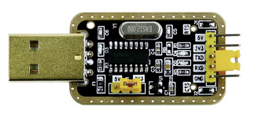
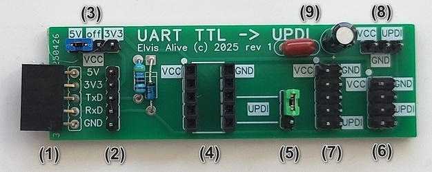
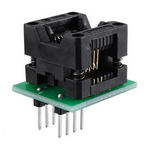
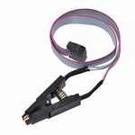

Simple Serial UDPI programmer PCB
=================================

This projects contains PCB of the simple UPDI programmer board, which converts TTL output of the 
USB UART dongle (base on chips like FTDI FT232, Silicon Labs CP210x, WCH CH330 etc) into UPDI with 
wide variety of pin configurations to connect programmed chip.

TTL UART to UPDI conversion itself is based on very simple wiring with one Schottky diode (eg. BAT-41) and one 470 ohm 
resistor connecting TxD to RxD described over the internet.

[**UPDI High-Voltage Activation**](https://developerhelp.microchip.com/xwiki/bin/view/software-tools/programmers-and-debuggers/avr-updi-info/) is not
available in this simple programmer!

PCB Features
------------

* (1) Angled female 5 pin header for direct connection to USB UART dongle, **MAKE SURE pins order matches** as some dongles hawe diferent order!
* (2) Male 5 pin header for connection to USB UART dongle using wires
* (3) Programmed chip VCC voltage selector (5V, 3V3 or nothing) - voltage source is USB dongle
* (4) DIL connector for zero force and other adapters with selectable UPDI pin (5). Can be used to plug 8 and more pins packages, which have different UPDI pin location.

* (6) Dual row pin header do directly connect SOIC8 clip

* (7) Dual row pin header do directly connect clip with more pins than 8 (has different location of UPDI pin)
* (8) Three pin header to connect programmed chip using wires
* (9) a bit of VCC filtering

All pins of all connectors are clearly marked. Unmarked pins are not connected.

Project Content
---------------

* Gerber file for PCB fab
* [DipTrace](https://diptrace.com/) PCB design file
* Examples how to use it from [PlatformIO](https://platformio.org/) projects with different programmer SW

License
-------
© 2025 This work is openly licensed via [CC BY-SA 4.0](https://creativecommons.org/licenses/by-sa/4.0/)